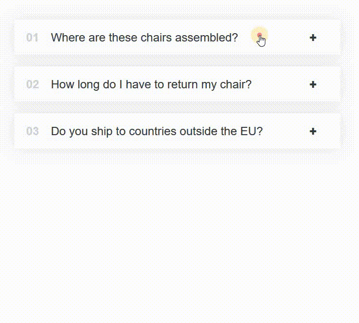

# React - To do list

# 🔗 [Live Preview](https://melodic-blini-80abb6.netlify.app/)

---

## About 👋

This project implements a reusable React component that renders an accordion structure, allowing users to expand and collapse sections for interactive information display.

---

## Features 👨‍💻

-   Dynamically displays FAQs or other content sections based on provided data.
-   Clicking on an accordion item expands or collapses its corresponding content.
-   Clear visual indicators (numbers and +/- symbols) for interaction.
-   Customizable CSS classes for styling (`.App`, `.accordion`, `.item`, `.number`, `.text`, `.icon`, `.content-box`).

---

## Languages

- React: functions, conditionals, useState,
- Styling: basic